# :mailbox_with_mail: Proxy Lab说明文档

## 概述

该lab实现了一个简单的http代理服务器`proxy`，支持基本的http代理功能、并发连接和静态缓存。`proxy`采用多线程和IO多路复用的方式实现并发。

## 使用方法

1. 编译程序
   ```shell
   # 编译http服务器tiny
   cd tiny
   make

   # 编译代理程序proxy
   cd ..
   make
   ```
2. 运行测试
   
    * 基本功能测试
      * 启动http服务
        ```shell
        # Terminal 1
        cd tiny
        ./tiny 8080
        ```
      * 启动proxy服务
        ```shell
        # Terminal 2
        ./proxy 8888
        ```
      * 测试proxy
        ```shell
        # Terminal 3
        curl -v --proxy localhost:8888 http://localhost:8080/home.html
        ```

    * 运行评测脚本
        ```shell
        # 该脚本全面测试了proxy的基本功能、并发功能和缓存功能
        ./driver.sh
        ```
        运行结果如下：
        ```text
        *** Basic ***
        Starting tiny on 3126
        Starting proxy on 19346
        1: home.html
        Fetching ./tiny/home.html into ./.proxy using the proxy
        Fetching ./tiny/home.html into ./.noproxy directly from Tiny
        Comparing the two files
        Success: Files are identical.
        2: csapp.c
        Fetching ./tiny/csapp.c into ./.proxy using the proxy
        Fetching ./tiny/csapp.c into ./.noproxy directly from Tiny
        Comparing the two files
        Success: Files are identical.
        3: tiny.c
        Fetching ./tiny/tiny.c into ./.proxy using the proxy
        Fetching ./tiny/tiny.c into ./.noproxy directly from Tiny
        Comparing the two files
        Success: Files are identical.
        4: godzilla.jpg
        Fetching ./tiny/godzilla.jpg into ./.proxy using the proxy
        Fetching ./tiny/godzilla.jpg into ./.noproxy directly from Tiny
        Comparing the two files
        Success: Files are identical.
        5: tiny
        Fetching ./tiny/tiny into ./.proxy using the proxy
        Fetching ./tiny/tiny into ./.noproxy directly from Tiny
        Comparing the two files
        Success: Files are identical.
        Killing tiny and proxy
        basicScore: 40/40

        *** Concurrency ***
        Starting tiny on port 23108
        Starting proxy on port 21599
        Starting the blocking NOP server on port 29519
        Trying to fetch a file from the blocking nop-server
        Fetching ./tiny/home.html into ./.noproxy directly from Tiny
        Fetching ./tiny/home.html into ./.proxy using the proxy
        Checking whether the proxy fetch succeeded
        Success: Was able to fetch tiny/home.html from the proxy.
        Killing tiny, proxy, and nop-server
        concurrencyScore: 15/15

        *** Cache ***
        Starting tiny on port 19000
        Starting proxy on port 12061
        Fetching ./tiny/tiny.c into ./.proxy using the proxy
        Fetching ./tiny/home.html into ./.proxy using the proxy
        Fetching ./tiny/csapp.c into ./.proxy using the proxy
        Killing tiny
        Fetching a cached copy of ./tiny/home.html into ./.noproxy
        Success: Was able to fetch tiny/home.html from the cache.
        Killing proxy
        cacheScore: 15/15

        totalScore: 70/70
        ```


## 设计实现

### 模块设计

`proxy`被划分成3个模块：http模块、缓存模块和主程序模块。http模块负责http协议头的维护、解析和生成；缓存模块负责维护缓存页面；主程序模块构建`proxy`的并发执行逻辑，每个并发执行流调用http模块和缓存模块的功能。



#### http模块

为了维护http请求报文信息，http模块定义数据结构`HttpRequest`：

```cpp
struct ReadLine {
  char line[BUF_SIZE];
  int line_finish;      // line is end with \r\n
};

struct HttpRequest {
  struct {
    char method[32];
    char url[2048];
    char version[32];
  } request_line;

  struct {
    char host[256];
  } request_headers;

  ReadLine *origin_lines;
  size_t line_num;
  size_t cur_line;

  enum {
    PARSE_LINE,
    PARSE_HEADERS,
    PARSE_DATA
  } parse_state;
};
```

http模块提供对`HttpRequest`结构的如下操作：

* 初始化和释放`HttpRequest`变量；
* 解析读入的一行http请求，更新`HttpRequest`变量；
* 判断http请求解析状态，如请求行是否已解析、请求头'Host'字段是否已解析；
* 解析出错后相关处理函数。

#### 缓存模块

缓存模块基于文件系统实现http响应的静态缓存。实现要点如下：

* 地址映射：一个http响应内容被存储在一个常规文件中，文件路径通过`Host`信息和`URL`确定，表示为`<缓存根目录>/<Host信息><URL>`。若文件路径以`/`结尾，则去掉尾部所有的`/`。例如，`Host`="192.168.1.1:8080"，`URL`="/html/"，则缓存文件路径为`<缓存根目录>/192.168.1.1:8080/html`；
* 缓存命中：将一个http请求映射为缓存文件路径，若路径存在，则缓存命中。

#### 主程序模块

主程序模块基于多线程和IO多路复用来实现对http代理请求的并发处理。主线程开启多个工作线程，把客户端请求均匀分配给所有工作线程。每个工作线程基于IO多路复用的方式同时处理多个客户请求。当一个请求对应的文件描述符fd可读时，从fd读取内容，并根据该描述符的当前状态执行相应的处理过程。文件描述符的状态和对应的处理过程如下：


* Unconnected状态：表示还未从客户端连接描述符client_fd中读取到完整的目的主机信息。位于该状态时，执行如下步骤：
  * 从client_fd中读取并解析一行请求信息；
  * 若已解析到完整的目的主机信息，则调用缓存模块接口判断缓存是否命中，若命中，则状态转移至Cached状态；
  * 若不命中，向目的主机建立连接（描述符为server_fd），发送目前已经从客户端接收到的所有请求行，状态转移至Connected状态。server_fd状态设为Server。

* Connected状态：表示已经与该客户端请求的目的主机建立了连接，对应的连接描述符为server_fd。位于该状态时，执行如下步骤：
  * 从client_fd中读取一行并写入server_fd中。

* Cached状态：表示客户端请求内容有本地缓存。位于该状态时，执行如下步骤：
  * 将缓存内容写入client_fd中;
  * 断开client连接。

* Server状态：表示与目的主机建立的连接的描述符server_fd的唯一状态，其对应的客户主机连接描述符为client_fd。位于该状态时，执行如下步骤：
  * 从server_fd中读取一行并写入client_fd中；
  * 调用缓存模块接口将最新读到的一行写入到缓存文件中。

### 文件/目录说明

* `proxy.c`: proxy主程序代码
* `http.c`: http模块的实现代码
* `cache.c`: 缓存模块的实现代码
* `csapp.c`: 封装了错误处理的unix系统编程常用接口
* `nop-server.py`: 一个阻塞且无响应的迭代服务器，用于测试`proxy`的并发功能
* `driver.sh`: 评测`proxy`的基本功能、并发功能和缓存功能
* `test/`: 测试目录，存放模块测试代码
* [`tiny/`](tiny/): 简易的迭代式的http服务器，支持基于get方法的静态和动态页面获取
* `util/`: 端口号相关的实用工具
    * `port-for-user.pl`: 为指定用户生成一个随机偶数端口号
    * `free-port.sh`: 输出一个可用的TCP端口号

## 技术目标

* 了解并发程序三种实现方式——多进程、IO多路复用和多线程的概念和优缺点；
* 掌握基于多线程和IO多路复用的并发程序的设计与实现；
* 掌握socket网络编程的基本结构；
* 了解多线程的信号处理和单进程的信号处理的区别；
* 熟悉UNIX文件IO的常用接口。
