# :shell: TinyShell 设计文档

## 功能说明

TinyShell是一个简易版的shell程序，对应的可执行程序为`tsh`。
与其他shell程序一样，`tsh`的整体执行流可以描述为“从标准输入读取命令，解析命令，执行命令”的无限循环过程。
`tsh`的具体功能如下：

* 解析命令：通过字符串解析，识别出前台执行的本地命令、后台执行的本地命令、shell内置命令（quit jobs bg fg）。
* 执行命令
  * 前台命令：命令字符串最后没有`&`的命令为前台命令。执行前台命令时，`tsh`创建子进程并执行命令对应的可执行性文件。`tsh`阻塞，直到前台子进程执行结束或者前台子进程因接收信号暂停。
  * 后台命令：命令字符串最后带有`&`的命令为后台命令。执行后台命令时，`tsh`创建子进程并执行命令对应的可执行性文件，但不阻塞，而是继续接收后续命令输入。
  * 内置命令：内置命令在`tsh`进程中立即执行。
    * `quit`：向所有子进程发送SIGHUP信号，退出程序，终止`tsh`进程。
    * `jobs`：输出当前所有任务的信息。
    * `bg`：`bg pid`将进程号为pid的任务放入后台继续运行，`bg %jid`将任务号为jid的任务放入后台继续运行。
    * `fg`：`fg pid`将进程号为pid的任务放入前台继续运行，`fg %jid`将任务号为jid的任务放入前台继续运行。
* 任务管理：任务是指由`tsh`进程创建的所有正在运行的子进程。每个任务由以下内容描述：进程号、任务号、任务状态、命令。每个任务有三种状态ST、FG和BG，分别对应暂停、前台运行和后台运行。状态之间存在如下转移关系：
  * FG->ST：前台进程收到SIGTSTP或SIGSTOP信号
  * ST->FG：通过`fg`命令使任务继续在前台执行
  * ST->BG：通过`bg`命令使任务继续在后台执行
  * BG->FG：通过`fg`命令把后台任务提至前台运行
  * BG->ST：后台进程收到SIGTSTP或SIGSTOP信号

要保证shell功能的正确，`tsh`需要处理相关的UNIX信号。`tsh`能够通过ctrl-C或ctrl-Z来终止或暂停前台任务。这是通过处理SIGINT或SIGTSTP信号实现的。`tsh`需要实时跟踪所有子进程状态的变化，从而更新任务的正确状态，保证任务管理功能的正确性。这是通过妥善处理SIGCHLD信号实现的。

## 系统设计

### 多进程结构

* `tsh`进程最多存在1个前台运行的子进程
* `tsh`进程可以有多个后台运行的子进程和后台暂停的子进程
* `tsh`进程和所有子进程的进程组互不相同，避免向一个进程发送的信号影响其他进程

### 程序数据流

`tsh`程序中的数据流分为两类，一类是以用户输入命令开始的同步数据流，另一类是以内核发送信号开始的异步数据流。在同步数据流中，用户命令经过解析后被分为两大类：内置命令和本地命令。对于内置命令，`tsh`根据每个内置命令的功能，更新相关任务的状态或者向标准输出输出信息。对于本地命令，`tsh`解析出命令的可执行文件和参数信息，使用fork-exec创建出子进程，并在jobs列表中插入子进程的任务信息。异步数据流处理见[信号处理](#信号处理)部分。

### 信号处理

下面分别说明SIGQUIT、SIGINT、SIGTSTP和SIGCHLD四种信号的处理过程：

* SIGQUIT：输出退出信息，向子进程发送SIGHUP信号，退出`tsh`程序。
* SIGINT：在jobs列表中查询当前前台进程，若存在前台进程，则向其发送SIGINT信号。
* SIGTSTP：在jobs列表中查询当前前台进程，若存在前台进程，则向其发送SIGTSTP信号。
* SIGCHLD：使用wait系统调用函数族回收所有终止的子进程，并删除这些子进程在jobs列表中对应的任务；使用wait系统调用函数族识别出所有暂停或继续运行的子进程，并更新这些子进程在jobs列表中对应的任务的状态。

## 技术目标

* 熟悉UNIX进程管理的系统调用：fork、exec、wait等；
* 熟悉UNIX信号机制，掌握异步安全的信号处理函数的写法；
* 掌握sigsuspend系统调用实现进程和信号之间的同步的方法。